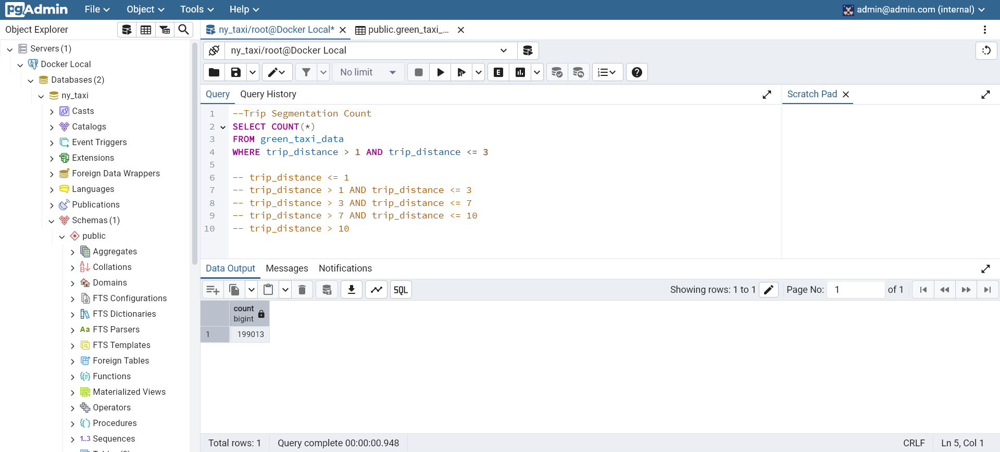
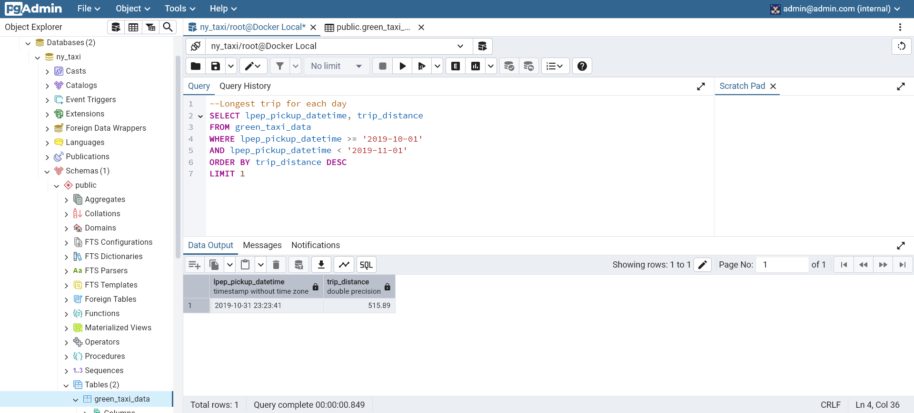
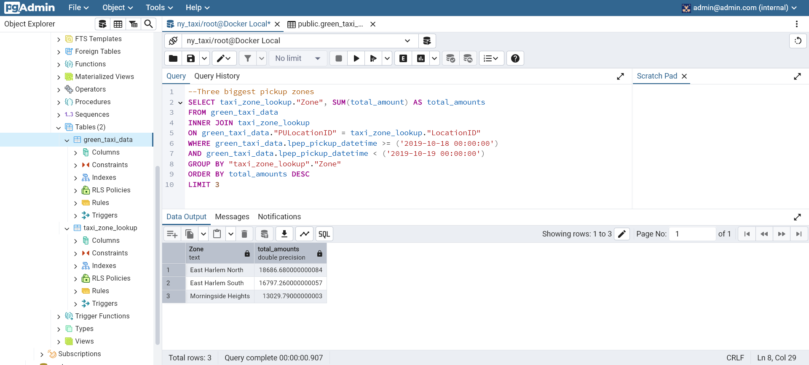
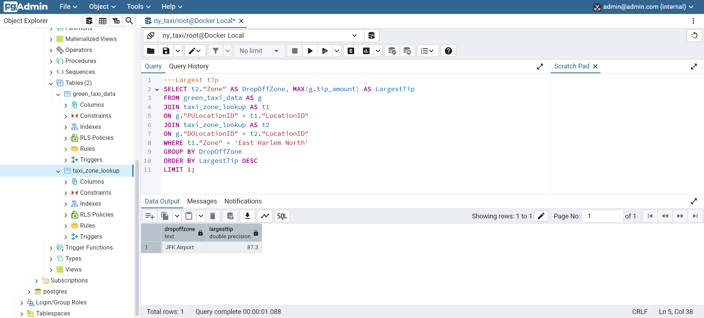

# NYC Taxi Data Ingestion and Analysis

## Overview

This project focuses on setting up a Dockerized PostgreSQL database to work with NYC taxi data, building a data pipeline, and performing analysis. The README includes detailed step-by-step instructions and queries for completing various tasks.

## Docker Setup

## Data Pipeline

### Building Docker Image

Build a Docker image for the data ingestion pipeline:

- image for ingest green_trip_data

```bash
docker build -t taxi_ingest:v001 .
```

- image for ingest taxi_zone_lookup

```bash
docker build -t taxi_ingest:v002 .
```

## Running Data Pipeline Container

### Run Data Pipeline for green_trip_data

```bash
URL="https://github.com/DataTalksClub/nyc-tlc-data/releases/download/green/green_tripdata_2019-10.csv.gz"

docker run -it \
  --network=pg-network \
  taxi_ingest:v001 \
    --user=root \
    --password=root \
    --host=pg-database \
    --port=5432 \
    --db=ny_taxi \
    --table_name=green_taxi_data \
    --url=${URL}
```

Dockerfile

```bash
FROM python:3.12.8

RUN apt-get install wget
RUN pip install pandas sqlalchemy psycopg2

WORKDIR /app

COPY ingest_data.py ingest_data.py

ENTRYPOINT [ "python", "ingest_data.py" ]
```

### Run Data Pipeline for taxi_zone_lookup

```bash
URL="https://github.com/DataTalksClub/nyc-tlc-data/releases/download/misc/taxi_zone_lookup.csv"

docker run -it \
  --network=nyc-taxi-data-ingestion-docker-sql-terraform_pg-network \
  taxi_ingest:v002 \
    --user=root \
    --password=root \
    --host=pg-database \
    --port=5432 \
    --db=ny_taxi \
    --table_name=taxi_zone_lookup \
    --url=${URL}
```

note: change network if you use docker-compose with apropriate network, use docker network ls to look up. i.e nyc-taxi-data-ingestion-docker-sql-terraform_pg-network

Dockerfile

```bash
FROM python:3.12.8

RUN apt-get install wget
RUN pip install pandas sqlalchemy psycopg2

WORKDIR /app

COPY ingest_taxi_zone.py ingest_taxi_zone.py

ENTRYPOINT [ "python", "ingest_taxi_zone.py" ]
```

## Docker Compose

Docker Compose used to run multiple container. In this project, it is used to define and run the entire stack that already configure in docker-compose.yaml

To deploy the entire stack using Docker Compose:

```bash
docker-compose up
```

To stop and remove container, without deleting the volume

```bash
docker-compose down
```

## Data Analysis

### Question 3. Trip Segmentation Count

During the period of October 1st 2019 (inclusive) and November 1st 2019 (exclusive), how many trips, **respectively**, happened:

1. Up to 1 mile
2. In between 1 (exclusive) and 3 miles (inclusive),
3. In between 3 (exclusive) and 7 miles (inclusive),
4. In between 7 (exclusive) and 10 miles (inclusive),
5. Over 10 miles

```sql
SELECT COUNT(*)
FROM green_taxi_data
WHERE trip_distance > 1 AND trip_distance <= 3

-- trip_distance <= 1
-- trip_distance > 1 AND trip_distance <= 3
-- trip_distance > 3 AND trip_distance <= 7
-- trip_distance > 7 AND trip_distance <= 10
-- trip_distance > 10
```

note: change commented query for each case.



### Question 4. Longest trip for each day

Which was the pick up day with the longest trip distance?
Use the pick up time for your calculations.

Tip: For every day, we only care about one single trip with the longest distance.

```sql
--Longest trip for each day
SELECT lpep_pickup_datetime, trip_distance
FROM green_taxi_data
WHERE lpep_pickup_datetime >= '2019-10-01'
AND lpep_pickup_datetime < '2019-11-01'
ORDER BY trip_distance DESC
LIMIT 1
```



### Question 5. Three biggest pickup zones

Which were the top pickup locations with over 13,000 in
`total_amount` (across all trips) for 2019-10-18?

Consider only `lpep_pickup_datetime` when filtering by date.

```sql
--Three biggest pickup zones
SELECT taxi_zone_lookup."Zone", SUM(total_amount) AS total_amounts
FROM green_taxi_data
INNER JOIN taxi_zone_lookup
ON green_taxi_data."PULocationID" = taxi_zone_lookup."LocationID"
WHERE green_taxi_data.lpep_pickup_datetime >= ('2019-10-18 00:00:00')
AND green_taxi_data.lpep_pickup_datetime < ('2019-10-19 00:00:00')
GROUP BY "taxi_zone_lookup"."Zone"
ORDER BY total_amounts DESC
LIMIT 3
```



### Question 6. Largest tip

For the passengers picked up in October 2019 in the zone
named "East Harlem North" which was the drop off zone that had
the largest tip? Show the Zone value

```sql
---Largest tip
SELECT t2."Zone" AS DropOffZone, MAX(g.tip_amount) AS LargestTip
FROM green_taxi_data AS g
JOIN taxi_zone_lookup AS t1
ON g."PULocationID" = t1."LocationID"
JOIN taxi_zone_lookup AS t2
ON g."DOLocationID" = t2."LocationID"
WHERE t1."Zone" = 'East Harlem North'
GROUP BY DropOffZone
ORDER BY LargestTip DESC
LIMIT 1;
```



These queries are designed to address specific analytical questions related to taxi trip data on 2019-10, trip segmentation, longest trip distance for each day, biggest pickup zones, and largest tip by zone.
